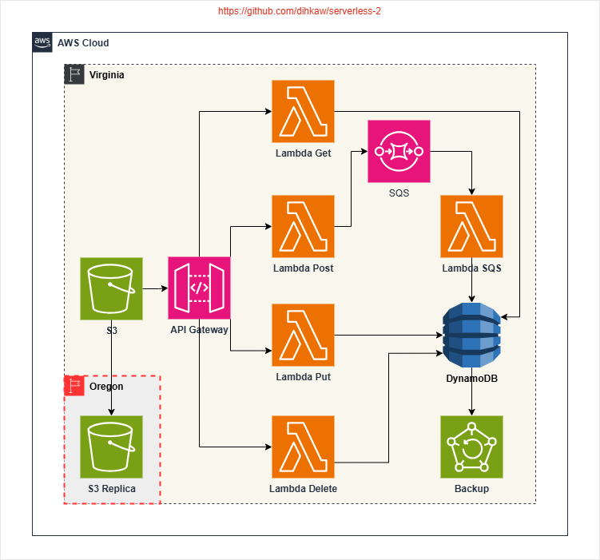

# Alur Kerja Pembuatan Web Static Buku Tamu

Proyek ini adalah **buku tamu digital** yang digunakan pada acara resepsi pernikahan. Aplikasi ini terdiri dari:
1. **Halaman Web Static** yang dihosting di **AWS S3**.
2. **API Gateway** untuk menangani request **GET, POST, PUT, dan DELETE**.
3. **AWS Lambda (Python)** sebagai backend untuk memproses permintaan.
4. **DynamoDB** untuk menyimpan data tamu.



---

## **1. Membuat Halaman Web Static (S3)**
**Langkah-langkah:**
1. Buat **bucket S3** melalui AWS Console dengan nama `buku-tamu-static-namadepan`.
2. Upload file **index.html**, **script.js**, dan **style.css**.
3. Aktifkan **Static Website Hosting** pada bucket S3.
4. Pastikan pengaturan CORS telah diatur agar API dapat diakses dari frontend.

---
## **2. Membuat API Gateway**
**API Gateway digunakan untuk menangani request HTTP**, dengan endpoint berikut:
| Method  | Endpoint             | Deskripsi                   |
|---------|----------------------|-----------------------------|
| `GET`   | `/guests/`                  | Mendapatkan semua tamu      |
| `POST`  | `/guests/`                  | Menambahkan tamu baru       |
| `PUT`   | `/guests/{id}`              | Memperbarui data tamu       |
| `DELETE`| `/guests/{id}`              | Menghapus data tamu         |

update file **script.js** Anda untuk menambahkan URL API

---

## **3. Membuat Lambda**
**Setiap metode HTTP dihubungkan ke Lambda Function berikut:**
- `POST`: `lambda_add_guest.py`
- `GET`: `lambda_get_guests.py`
- `PUT`: `lambda_update_guest.py`
- `DELETE`: `lambda_delete_guest.py`

---

## **4. Menyimpan Data ke DynamoDB**
Buat tabel **DynamoDB** dengan nama `BukuTamuTable` dengan:
- **Partition Key**: `id` (String)
- **Atribut Lain (opsional)**: `nama`, `pesan`

**Struktur Data:**
```json
{
  "id": "1707898761",
  "nama": "Andi",
  "pesan": "Selamat menikah!"
}
